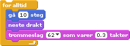

# Felix og Herbert

## Komme i gang med Scratch

### Veiledning for instruktør

Formålet med denne første sesjonen er at barna skal bli kjent med Scratch-miljøet og grensesnittet, slik at de kan håndtere prosjektene på Kodeklubben med lite eller ingen hjelp. De trenger å forstå hva alle hovedelementene i Scratch-grensesnittet gjør og hva de heter. De må også kunne vite hvordan de utfører enkelte fundamentale oppgaver, som hvordan man lager en ny figur og å sette sammen blokker til skript.

Det kan være en god idé å finne ut hvor mange av barna som har brukt Scratch tidligere. Dersom flesteparten har det, vil du kunne gå gjennom denne øvelsen ganske fort. Det tar omtrent 15-20 minutter å gå gjennom denne øvelsen før man kan begynne på det første spillprosjektet: ‘Felix og Herbert’.

### Fremgangsmåte

Denne første sesjonen er i hovedsak drevet av instruktøren. Senere vil barna selvstendig følge oppgaveark og du er der for å hjelpe hvis noen setter seg fast og for å forklare kodekonsepter. Det beste er om du bruker en projektor e.l. slik at alle barna kan se ditt PC-bilde. Barna bør sitte ved sine egne PCer. Når du går gjennom sesjonen, bør fremgangsmåten være:

* Du utfører et steg slik at alle barna kan se det.
* Du forklarer kort hva du gjorde.
* Alle barna utfører det samme steget.
* Du kontrollerer at alle klarte det.
* Hvis et av barna har et problem, gå til barnet og hjelp det å gjennomføre steget.
* Gå ikke videre til det neste steget før alle barna har klart det forrige.
* Gå videre til neste steg.

Du vil legge merke til at hvert steg er veldig lite. Dette er gjort med hensikt for å forsikre at alle barna klarer å gjennomføre alle stegene. Hvis stegene er større, er sjansen stor for at noen barn ikke klarer å følge med. Med slike små steg, blir problemene mer åpenbare.
Denne prosessen kan ta litt tid, men det er essensielt at du bruker den nødvendige tiden på at barna skal bli kjent med Scratch. Dette vil spare mye tid i fremtiden. Hvis barna deler PCer, av behov eller valg, prøv å la alle få like mye tid i førersetet.

### Fremtreden

I løpet av denne sesjonen møter barna Kodeklubben for første gang. Derfor er det veldig viktig at du skaper et inkluderende og støttende miljø hvor barna føler seg velkomne. Ikke forhast deg og prøv ikke å bli oppgitt over mangel på fremdrift eller forståelse. Les dokumentet "Hvordan skape et positivt læremiljø":http://kodeklubben.no for ytterligere veiledning.

### Steg

Gå gjennom ett og ett av disse stegene. Forsikre deg om at alle barna har utført ett steg før du fortsetter med det neste.
* Åpne Scratch
* Gi Figur1 navnet ‘Felix’

### Frittstående blokker

* Dobbeltklikk på blokken  i -kategorien. Forklar at Felix har flyttet seg.
* Høyreklikk på blokken og vis hjelpen.
* Dra blokken  inn i skript-området.
* Dobbeltklikk på blokken i skript-området. Vis at Felix flytter seg igjen.
* Dobbeltklikk på blokken noen ganger for å flytte Felix.
* Vis hvordan man åpner -kategorien.
* Dra -blokken inn i skript-området.
* Dobbeltklikk på ‘trommeslag’-blokken i skript-området for å vise at den lager lyd.
* Endre trommenummeret til 62 og varigheten til 0,3 takter.
* Dobbeltklikk på ‘trommeslag’-blokken igjen for å vise at den har endret seg.
* Påpek at de to blokkene er uavhengige.

### Skript

* Sett sammen de to blokkene i skript-området.
* Dobbeltklikk på de sammensatte blokkene. Påpek at Felix beveger seg og lager en lyd.
* Legg skriptet inn i en -løkke.
* Dobbeltklikk på skriptet og se at Felix marsjerer til kanten av scenen.
* Dra Felix tilbake til midten av scenen.

### Drakter

* Kommenter at vi ønsker at Felix beveger beina når han går.
* Åpne -fanen.
* Vis at Felix har to drakter.
* Åpne -fanen
* Legg til  fra -kategorien inn i løkken.
* Dobbeltklikk på skriptet og se at Felix går til kanten av scenen.
Du har nå et skript som ser slik ut:

### Lagre og del prosjektet

* Klikk på Fil-menyen.
* Klikk på Lagre.
* Gi filen et navn.
* Klikk OK. Påpek animasjonen som kommer når man lagrer.
* Klikk på Legg ut-menyen
* Klikk på ‘Legg ut prosjektet på internett…’
* Fyll inn skjemaet.
* Klikk OK for å dele prosjektet.
* Bruk en nettleser for å se spillet på nettsiden til Scratch.
* Spill spillet på websiden.

### Avslutning

* Vis frem oppgavearket ‘Felix og Herbert’. Si at barna kan fortsette med dette prosjektet ved å følge oppgavearket. Barna er allerede nesten ferdige med hele den første delen.
* Del ut illustrasjonen av Scratch-grensesnittet. Gjør dette på slutten slik at barna ikke blir distrahert av utdelingen i løpet av timen.
* Explain Project resource folders within Scratch and Scratch Cards.
* Forklar hvordan barna kan lagre arbeidet på nettsiden til Scratch på slutten av hver time. Dette er forskjellig fra skole til skole.

