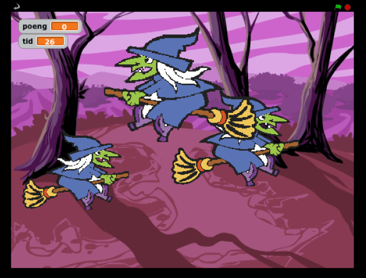
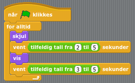
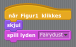
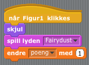
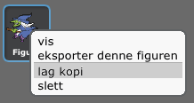

# Spøkelsesjakten

## Introduksjon { .intro}

Dette prosjektet er inspirert av tivolispillet _whack-a-mole_, 	hvor man slår muldvarper ned igjen i hullene sine. I vårt spill er det spøkelsene som blir borte når vi klikker på dem. Målet er å klikke bort flest mulig i løpet av 30 sekunder.

|Sjekkliste| Følg instruksjonene på lista. Huk av etter hvert|
|---|-----|
|**Test**| **Klikk på det grønne flagget for å teste koden**|
|**Lagre**| **Husk å lagre koden når du har lagt til noe nytt**|

## Steg 1: Lag et flyvende spøkelse { .activity}

### Sjekkliste { .check}

+. __Start et nytt Scratch-prosjekt__.
+ __Slett kattefiguren__ ved å høyreklikke på den og velge 'slett'
+ Endre bakgrunnen til __nature/woods__
+ For å __legge til et spøkelse__ klikker du på 'legg til ny figur'. Hent en ny figur fra -knappen. Velg __fantasy/ghost1__

 

Du skal nå __lage en variabel__ som styrer hvor fort heksa beveger seg. Denne kan vi senere bruke til å endre hastigheten når spillet er i gang.

+. Klikk på 'Variabler' og deretter 'Lag en ny variabel'. Kall den __hastighet__. Huk av der det står 'Bare for denne figuren'.
+ På scenen skal variabelen hete _Figur1: hastighet_. Hvis den bare heter _hastighet_ så slett den og legg den til en gang til.  
+ Fjern avhukingen ved siden av variabelen, slik at den ikke blir med på scenen. 
+ Vi vil at __spøkelset skal bevege seg__ når spillet starter. Det gjør vi ved å lage følgende skript:

  [scratchblocks]
      når FLAG klikkes
      sett [hastighet v] til (5)
      for alltid
        gå [hastighet] steg
  [\scratchblocks]

### Test Prosjektet { .test}

__Klikk på det grønne flagget__. Hvorfor sitter spøkelset fast når det treffer kanten på skjermen?

### Sjekkliste { .check}

+ For å unngå at spøkelset sitter fast i veggen så må vi få det til å __å gå tilbake__ når hun treffer den. Dette gjøres ved å legge til blokken 'sprett tilbake ved kanten'  under 'bevegelse'. Skriptet ser da slik ut:

  [scratchblocks]
      når FLAG klikkes
        sett [hastighet v] til (5)
        for alltid
          gå [hastighet] steg
          sprett tilbake ved kanten
  [\scratchblocks]

+ For å hindre at hun snur seg opp-ned, klikk på -knappen i 'sprite'-boksen.

### Test prosjektet{ .test}

__Klikk på det grønne flagget__.

### Lagre prosjektet { .save}

### Ting å prøve { .try}

+ __Endre hastighetsvariabelen__, slik at heksa går raskere eller saktere.
+ Hvordan kan vi få spøkelset til å __gå fortere jo lenger det flyr?__ (Dette er nokså vanskelig, så ikke være bekymret hvis du ikke skjønner hvordan. Du vil få flere hint underveis.)

## Steg 2: Få spøkelset til å dukke opp og forsvinne { .activity}

__For å gjøre spillet morsommere vil vi få spøkelset til å dukke opp og forsvinne.__ 

### Sjekkliste { .check}

+ Vi lager et nytt skript, som skal kjøre samtidig med skriptet som beveger på spøkelset. Det nye skriptet __gjemmer bort spøkelset en tilfeldig periode__ og __viser det deretter frem igjen i en tilfeldig periode__. Dette skal skje om og om igjen, frem til spillet er slutt. Slik lager du skriptet:

 

  [scratchblocks]
      når FLAG klikkes
      for alltid
        skjul
        vent (tilfeldig tall fra (2) til (5)) sekunder
        vis
        vent (tilfeldig tall fra (3) til (5)) sekunder
  [\scratchblocks]

### Test prosjektet { .test}

__Klikk på det grønne flagget__. Flytter heksa fra side til side? Forsvinner hun og dukker opp igjen helt tilfeldig? Da er alt riktig.

### Lagre prosjektet { .save}

###Ting å prøve { .try}

+ Prøv å __endre tallene i koden__ der det står 'tilfeldig tall fra ( ) til ( )'. Hva skjer hvis du velger veldig store eller små tall? (Dette gir deg kanskje et nytt hint for hvordan vi skal få heksa til å gå fortere jo lenger man spiller.)

## Steg 3: Tryll bort spøkelset med et klikk! { .activity}

__For å gjøre dette til et ordentlig spill må vi gi spilleren noe å gjøre - for eksempel å trylle spøkelset. Når det skjer vil vi også at det skal komme en stilig tryllelyd!__

### Sjekkliste { .check}

+ Fra 'Lyd'-boksen henter du lyden __Electronic/Fairydust__.
+ Så lager du skriptet som får __spøkelset til å forsvinne__ når hun blir klikket på:

  [scratchblocks]
      når [sprite1 v] klikkes
      skjul
      spill lyden [Fairydust v]
  [\scratchblocks]
  
### Test prosjektet { .test}

__Klikk på det grønne flagget__. Forsvinner heksa med en tryllelyd når du klikker på henne? 

### Lagre prosjektet {.save}

### Ting å prøve { .try}

+ Spør hjelperen din om du kan ta opp en egen lyd. Denne kan brukes istedenfor tryllelyden.

## Steg 4: Legg til tid og poeng { .activity}

__Vi har et spøkelse å trylle bort, så nå vil vi ha poeng for å gjøre det! Vi vil også ha en tidsfrist, slik at det er om å gjøre å få flest mulig poeng på denne tiden. Vi løser begge deler ved å bruke variabler.__

### Sjekkliste { .check}

+ Lag en ny variabel som heter _poeng_. Denne skal gjelde for alle figurer. Legg til en ny blokk som gjør at __poengvariabelen økes__ med 1 poeng, for hver gang spilleren klikker på heksa.

  [scratchblocks]
      når [sprite1 v] klikkes
      skjul
      spill lyden [Fairydust v]
      endre [poeng v] med (1)
  [\scratchblocks]

+ Bytt til 'Scene' og lag en ny variabel som heter _tid_. Velg 'vis på scenen' og 'bare for denne figuren'. 
Lag et nytt skript som kjører når det grønne flagget klikkes. Legg inn følgende blokker:  %(variabel)sett tid til% 30 (sekunder)  %(variabel)sett tid til%  0
+ Bruk så en %(styring)gjenta til% -blokk %(styring)for å vente% 1 %(styring)sekunder% og deretter redusere tiden med 1 sekund ( %(variabel)endre tid med% -1 ). Denne skal kjøre fram til tiden er ute ( %(operator)tid = 0% ).  Til slutt stopper du hele spillet med en %(styring)stopp alle% -blokk. !(skript). skript-4.png!

### Test prosjektet { .test}

### Lagre prosjektet { .save}

### Ting å prøve { .try}

+ Hvordan får du heksa til å gå fortere når spillet er i gang?
+ __Bra jobba!__. Nå er du egentlig ferdig med spillet, men prøv deg gjerne på neste steg også.

### En ekstra utfordring: Flere hekser! { .challenge}

Hvis et spøkelse er bra, må vel flere være bedre! La oss ha tre spøkelser flyvende rundt! 

+ __Lag flere spøkelser__ ved å høyreklikke på den du allerede har, og så kopiere denne:
+ __La spøkelsene få ulik størrelse__. Dette gjør du ved først å klikke på 'Drakter' og deretter 'Rediger'. Velg så én av knappene under. Den til venstre forstørrer figuren og den til høyre forminsker:
+ Du kan også __endre spøkelsenes flyvefart__. Dette gjøres i  'hastighet'-variabelen i det øverste skriptet for hver enkelt figur.
+ For at nedtellingen skal gå i riktig tempo må det nederste skriptet (det som teller ned sekunder) slettes fra to av figurene.
+ Til slutt kan du __spre spøkelsene__ litt bedre ut på scenen. Dette gjør du ved å klikke og dra figurene rundt i selve skjermbildet.

### Test prosjektet { .test}

+__Klikk på det grønne flagget.__ Har du nå tre hekser som flyr fra side til side? Plutselig forsvinner og dukker opp igjen? Forsvinner når du klikker på dem?
Gratulerer! Da har du gjort alt riktig!

### Lagre prosjektet { .save}

### Ting å prøve { .try}

+ Hvor mange spøkelser synes du spillet fungerer best med? __Legg til flere__ og prøv!
+ Klarer du å få spøkelsene til __å se forskjellige ut__? Klikk på 'Drakter' og prøv deg frem. Du kan også velge noen av blokkene under 'Utseende'.
+ Kan du få spøkelsene til __å bli verdt forskjellige antall poeng?__ Hva med å få den minste og raskeste til å gi 10 poeng?

Bra jobba! Nå er du ferdig, og det er på tide med litt seriøs spilling. Husk også at du kan dele spillet med vennene dine. Det gjør du ved å klikke på 'Legg ut' i toppmenyen.
