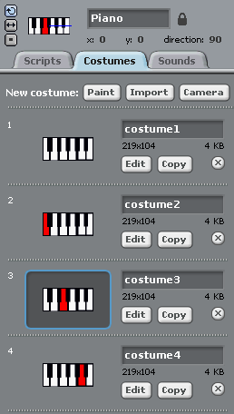

---
title: Scratchkort - Piano
level: Nivå 4
language: nb-NO
stylesheet: scratch
embeds: "*.png"
materials: "*.sb2"
...

## Sjekkliste { .check}

+ Tegn et piano ved å lage svarte og hvite regktangler.
  

+ Lag så et skript som spiller en note når "a" trykkes.
```blocks
when [a v] key pressed
broadcast [piano-1 v]

when I receive [piano-1 v]
play note (60 v) for (0.5) beats
```
+ Lag to noter til når man trkker "s" eller "d" på tastaturet.
```blocks
when [a v] key pressed
broadcast [piano-1 v]

when [s v] key pressed
broadcast [piano-2 v]

when [d v] key pressed
broadcast [piano-3 v]

when I receive [piano-1 v]
play note (60 v) for (0.5) beats

when I receive [piano-2 v]
play note (64 v) for (0.5) beats

when I receive [piano-3 v]
play note (67 v) for (0.5) beats
```

+ Kopier kostymet 3 ganger. Fyll ut en annen tast for hver.
  
  
+ Sørg for at hver note bytter til et annet kostyme og tilake til
  `costume1`{.blockblue}.
```blocks
when I receive [piano-1 v]
switch to costume [costume2 v]
play note (60 v) for (0.5) beats
switch to costume [costume1 v]

when I receive [piano-2 v]
switch to costume [costume3 v]
play note (64 v) for (0.5) beats
switch to costume [costume1 v]

when I receive [piano-3 v]
switch to costume [costume4 v]
play note (67 v) for (0.5) beats
switch to costume [costume1 v]
```

# Utfordring {.challenge} En måte å endre instrumentet.
```blocks
when [up-arrow v] key pressed
set instrument to (pick random (1) to (99))
```
