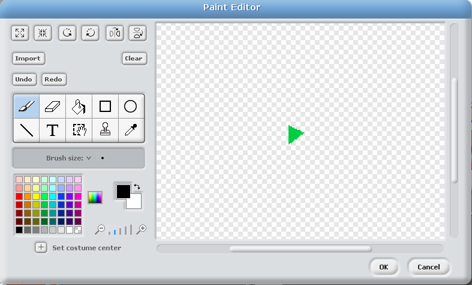

---
title: Scratchkort - Opptaker
level: Nivå 4
language: nb-NO
stylesheet: scratch
embeds: "*.png"
materials: "*.sb2"
...

## Sjekkliste { .check}

+ Lag to nye lister (for alle figurer). Kall en av dem
  `instrument`{.blockred} og den andre `timing`{.blockred}.

+ Lag en ny variabel (for alle figurer) som heter `recording`{.blockorange}

+ For hvert at instrumentene (tromme, piano, hver lyd etc.), må du
  legge til følgen i `when I receive`{.blockbrown} blokken.
```blocks
if <(recording) = (1)>
  add (timer) to [timing v]
  add (cat) to [instrument v]
```
  Endre ordet  “cat” in `add [cat] to [instrument v]`{.blockred} slik at det stemmer med
  navnet til meldinger som brukes for å spille denne lyden.
```blocks
when I receive [drum v]
play drum (48 v) for (0.2) beats
if <(recording) = (1)>
  add (timer) to [timing v]
  add (cat) to [instrument v]
end
set size to (110) %
wait (0.1) secs
set size to (100) %
```

+ Tegn en ny figur og gi den en rød sirkeldrakt. Gi denne figuren navnet “Record”.
  

+ Lag et skript som setter `recording`{.blockorange} til 1 og sletter alle
  `instrument`{.blockred} og `timing`{.blockred} når man trykker på det.

## Test prosjektet {.flag}
  Prøv å trykk på opptaksknappen. Hva skjer når du spiller på instrumentene?

+ Lag en ny figur og lag en drak som ser ut som en grønn pil.
  Kall denne “Play”.
  

+ Lag en ny variabel som du kaller `index`{.blockorange} Play only.

+ Nå må vi få avspillingen til å gjøre noe. Legg dette skriptet til
  "Play"
```
when Play clicked
set [recording v] to (0)
set [index v] to (1)
reset timer
forever
  if <(item (index) of [timing v]) < (timer)>
    broadcast (item (index) of [instrument v])
    change [index v] by (1)
    if <(index) > (length of [timing v])>
      stop script
    end
  end
end
```

## Test prosjektet {.flag}
Trykk på den grønne play knappen. Hva skjer?

Trykk på den røde knappen og spill på noen intrumenter. Etter at du er ferdig,
trykk på den grønne play knappen igjen. Hva skjer?

Spill på flere instrumenter uten å trykke på record. Trykk så på den grønne play
knappen igjen. Hva skjer?
